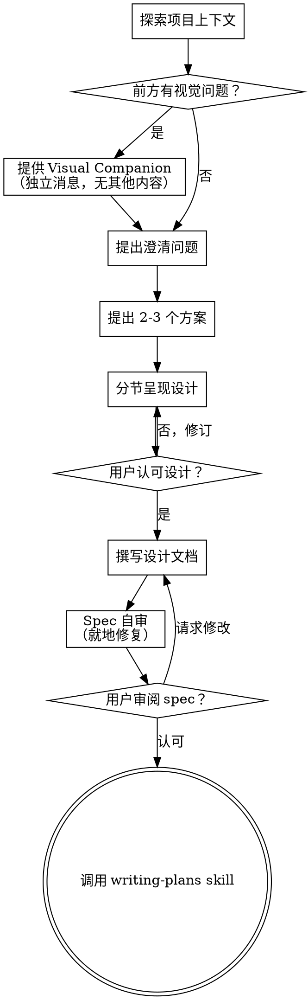

# 把想法 Brainstorm 成设计

通过自然的协作对话，帮助把想法转化成完整成形的设计和 spec。

先了解当前项目上下文，然后每次问一个问题来精炼想法。一旦你理解了要构建什么，呈现设计并获得用户认可。

<HARD-GATE>
在你呈现一份设计并获得用户认可之前，不要调用任何实施类 skill、不要写任何代码、不要 scaffold 任何项目、不要采取任何实施动作。这适用于**每一个**项目，不论它看起来多简单。
</HARD-GATE>

## 反模式："这事简单到不需要设计"

每个项目都要走这个流程。一个 todo list、一个单函数工具、一次配置变更——全都要。"简单"的项目恰恰是未被审视的假设最浪费工作的地方。设计可以很短（真正简单的项目几句话即可），但你必须呈现它并获得认可。

## 检查清单

你必须为以下每一项创建一个任务，并按顺序完成：

1. **探索项目上下文** — 查看文件、文档、近期 commits
2. **提供 Visual Companion**（如果话题会涉及视觉问题）—— 这是一条独立消息，不与澄清问题合并。见下方 Visual Companion 一节。
3. **提出澄清问题** — 一次一个，理解目的/约束/成功标准
4. **提出 2-3 个方案** — 附带权衡与你的推荐
5. **呈现设计** — 按复杂度分章节呈现，每节后获取用户认可
6. **撰写设计文档** — 保存到 `docs/superpowers/specs/YYYY-MM-DD-<topic>-design.md` 并 commit
7. **Spec 自审** — 就地快速检查占位符、矛盾、歧义、范围（见下文）
8. **用户审阅书面 spec** — 在继续前请用户审阅 spec 文件
9. **过渡到实施** — 调用 writing-plans skill 来创建实施计划

## 流程图

**终止状态是调用 writing-plans。** 不要调用 frontend-design、mcp-builder 或任何其他实施类 skill。brainstorming 之后你**唯一**调用的 skill 是 writing-plans。

## 流程

**理解想法：**

- 先查看当前项目状态（文件、文档、近期 commits）
- 在提出详细问题前评估范围：如果请求描述多个独立子系统（例如"构建一个包含聊天、文件存储、计费和分析的平台"），立刻提出。不要把问题花在精炼一个本应先分解的项目上。
- 如果项目对单个 spec 来说太大，帮用户分解为子项目：哪些是独立部分，它们如何关联，应按什么顺序构建？然后通过常规设计流程对第一个子项目 brainstorm。每个子项目都有自己的 spec → plan → 实施周期。
- 对范围合适的项目，一次问一个问题来精炼想法
- 尽量使用多选题，开放式也可
- 一条消息只问一个问题——如果话题需要更多探索，拆成多个问题
- 关注理解：目的、约束、成功标准

**探索方案：**

- 提出 2-3 个不同方案及权衡
- 以会话方式呈现选项，附带你的推荐和理由
- 先讲你推荐的选项并解释为什么

**呈现设计：**

- 一旦你认为理解了要构建什么，就呈现设计
- 按复杂度分节：简单的几句话，复杂的最多 200-300 字
- 每节后问到目前为止是否合理
- 涵盖：架构、组件、数据流、错误处理、测试
- 如果哪里不合理，准备好回头澄清

**为隔离与清晰而设计：**

- 把系统拆为更小单元，每个单元有一个明确目的，通过良定义的接口通信，可被独立理解和测试
- 对每个单元，你应能回答：它做什么、如何使用、依赖什么？
- 不读内部细节就能理解一个单元的作用吗？改内部细节不会破坏消费者吗？如果不能，那边界还需要打磨。
- 更小、边界清晰的单元对你也更友好——你对能一次性容纳进上下文的代码理解最好，文件聚焦时编辑也更可靠。一个文件变大时，往往意味着它做了太多事。

**在既有代码库中工作：**

- 在提出变更前先探索当前结构。遵循既有模式。
- 当既有代码存在影响本次工作的问题（如文件过大、边界不清、职责纠缠）时，把针对性改进作为设计的一部分——好开发者改自己经手代码就是这样做的。
- 不要提出无关的重构。聚焦于服务当前目标的事。

## 设计之后

**文档：**

- 把通过验证的设计（spec）写到 `docs/superpowers/specs/YYYY-MM-DD-<topic>-design.md`
  - （用户对 spec 位置的偏好覆盖此默认值）
- 如果有 elements-of-style:writing-clearly-and-concisely skill，使用它
- 将设计文档 commit 到 git

**Spec 自审：**
写完 spec 文档后，用新鲜的眼光看它：

1. **占位符扫描：** 有 "TBD"、"TODO"、未完成章节或模糊需求吗？修掉。
2. **内部一致性：** 是否有章节相互矛盾？架构是否匹配功能描述？
3. **范围检查：** 这是否足够聚焦能用一个实施计划做完，还是需要分解？
4. **歧义检查：** 任何需求是否可以被两种不同方式解读？若是，挑一种并明确写出来。

就地修复问题。无需复审——修完继续。

**用户审阅门：**
spec 自审循环通过后，在继续前请用户审阅书面 spec：

> "Spec 已写并 commit 到 `<path>`。请审阅，告诉我开始撰写实施计划前是否要做修改。"

等待用户回复。如果他们请求修改，做出修改并重跑 spec 自审循环。只有用户认可后才继续。

**实施：**

- 调用 writing-plans skill 创建详细实施计划
- 不要调用任何其他 skill。writing-plans 是下一步。

## 关键原则

- **一次一个问题** - 不要用多个问题压垮用户
- **优先多选题** - 比开放题更易作答（如能用）
- **YAGNI 无情** - 移除一切非必要功能
- **探索替代方案** - 决定前总是提 2-3 个方案
- **增量验证** - 呈现设计，获认可后才推进
- **保持灵活** - 哪里不合理就回去澄清

## Visual Companion

一个基于浏览器的伴侣工具，在 brainstorming 时用来展示 mockup、图表和视觉选项。它是工具，不是模式。接受 companion 意味着它对从中受益的视觉问题可用；并**不**意味着每个问题都通过浏览器。

**提供 companion：** 当你预计接下来的问题会涉及视觉内容（mockup、布局、图表），一次性征求同意：
> "我们要做的有些内容如果能在网页浏览器里展示给你看，可能会更容易解释。一路上我可以做 mockup、图表、对比和其他视觉物。这个功能还较新，可能比较费 token。要试试看吗？（需要打开一个本地 URL）"

**这个征询必须是一条独立消息。** 不要把它与澄清问题、上下文摘要或任何其他内容合并。该消息**只**包含上面的征询，别的什么都没有。等用户回复后再继续。如果拒绝，就用纯文本进行 brainstorming。

**逐题决定：** 即使用户同意了，也要**逐题**决定使用浏览器还是终端。测试：**用户是看到比读到更易理解吗？**

- **用浏览器** 处理本身就是视觉的内容——mockup、wireframe、布局对比、架构图、并排视觉设计
- **用终端** 处理文本内容——需求问题、概念选择、权衡列表、A/B/C/D 文本选项、范围决策

涉及 UI 话题的问题**不自动**就是视觉问题。"在这个语境下 personality 意味着什么？"是概念问题——用终端。"哪个 wizard 布局更好？"是视觉问题——用浏览器。

如果他们同意 companion，继续前阅读详细指南：
`skills/brainstorming/visual-companion.md`
