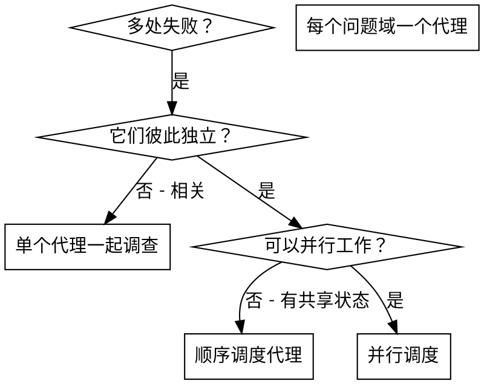

# 并行调度代理

## 概述

你将任务委派给上下文隔离的专门代理。通过精确构造它们的指令和上下文，确保它们专注并完成任务。它们绝不应继承你会话的上下文或历史——你为它们构造的恰是它们所需。这同时保留了你自己的上下文用于协调工作。

当存在多个互不相关的失败（不同测试文件、不同子系统、不同 bug）时，按顺序排查会浪费时间。每项调查都是独立的，可以并行进行。

**核心原则：** 一个独立问题域分派一个代理。让它们并发工作。

## 何时使用



**适用场景：**
- 3 个以上测试文件因不同根因失败
- 多个子系统各自独立地崩溃
- 每个问题可以脱离其他独立理解
- 调查之间没有共享状态

**不要使用：**
- 失败彼此相关（修一个可能修好其他）
- 需要理解完整系统状态
- 多个代理会互相干扰

## 范式

### 1. 识别独立的问题域

按"哪里坏了"对失败分组：
- 文件 A 测试：工具审批流程
- 文件 B 测试：批量完成行为
- 文件 C 测试：中止功能

每个域都是独立的——修复工具审批不会影响中止测试。

### 2. 创建聚焦的代理任务

每个代理获得：
- **明确范围：** 一个测试文件或子系统
- **清晰目标：** 让这些测试通过
- **约束：** 不要改其他代码
- **预期产出：** 你发现了什么、修了什么的摘要

### 3. 并行调度

```typescript
// 在 Claude Code / AI 环境中
Task("修复 agent-tool-abort.test.ts 的失败")
Task("修复 batch-completion-behavior.test.ts 的失败")
Task("修复 tool-approval-race-conditions.test.ts 的失败")
// 三个并发运行
```

### 4. 审查并整合

代理返回后：
- 阅读每份摘要
- 验证修复彼此不冲突
- 运行完整测试套件
- 整合所有更改

## 代理 prompt 结构

好的代理 prompt：
1. **聚焦** - 一个清晰的问题域
2. **自包含** - 理解问题所需的全部上下文
3. **输出明确** - 代理应该返回什么？

```markdown
修复 src/agents/agent-tool-abort.test.ts 中 3 个失败的测试：

1. "should abort tool with partial output capture" - 期望消息中出现 'interrupted at'
2. "should handle mixed completed and aborted tools" - 快工具被中止而非完成
3. "should properly track pendingToolCount" - 期望 3 个结果但得到 0

这些是时序/竞态问题。你的任务：

1. 阅读测试文件，理解每个测试在验证什么
2. 识别根因——时序问题还是真 bug？
3. 修复方式：
   - 用基于事件的等待替换任意 timeout
   - 如果发现中止实现有 bug，修复它
   - 如果测试验证的行为已改变，调整测试预期

不要只是增大 timeout——找到真正的问题。

返回：你发现了什么、修了什么的摘要。
```

## 常见错误

**❌ 过于宽泛：** "修复所有测试" - 代理会迷失
**✅ 具体：** "修复 agent-tool-abort.test.ts" - 聚焦范围

**❌ 无上下文：** "修复竞态条件" - 代理不知道在哪
**✅ 上下文：** 粘贴错误信息和测试名

**❌ 无约束：** 代理可能重构所有东西
**✅ 约束：** "不要改生产代码" 或 "只修测试"

**❌ 输出模糊：** "搞定它" - 你不知道改了什么
**✅ 具体：** "返回根因和变更的摘要"

## 何时不要使用

**相关联的失败：** 修一个可能修其他——先一起调查
**需要全局上下文：** 理解需要看整个系统
**探索性调试：** 你还不知道哪坏了
**共享状态：** 代理会互相干扰（编辑同一文件、共用同一资源）

## 来自会话的真实例子

**场景：** 一次大规模重构后，3 个文件中出现 6 个测试失败

**失败：**
- agent-tool-abort.test.ts：3 个失败（时序问题）
- batch-completion-behavior.test.ts：2 个失败（工具没执行）
- tool-approval-race-conditions.test.ts：1 个失败（执行次数 = 0）

**决策：** 独立域——中止逻辑、批量完成、竞态条件互相独立

**调度：**
```
代理 1 → 修复 agent-tool-abort.test.ts
代理 2 → 修复 batch-completion-behavior.test.ts
代理 3 → 修复 tool-approval-race-conditions.test.ts
```

**结果：**
- 代理 1：用基于事件的等待替换了 timeout
- 代理 2：修复了事件结构 bug（threadId 位置不对）
- 代理 3：增加了对异步工具执行完成的等待

**整合：** 所有修复彼此独立，无冲突，完整测试套件通过

**节省时间：** 3 个问题并行解决，远胜按顺序解决

## 关键收益

1. **并行化** - 多项调查同时进行
2. **聚焦** - 每个代理范围窄，要追踪的上下文少
3. **独立性** - 代理之间互不干扰
4. **速度** - 用解决 1 个问题的时间解决 3 个

## 验证

代理返回后：
1. **审查每份摘要** - 理解都改了什么
2. **检查冲突** - 代理是否编辑了同一段代码？
3. **运行完整套件** - 验证所有修复协同工作
4. **抽查** - 代理可能犯系统性错误

## 真实世界影响

来自调试会话（2025-10-03）：
- 3 个文件共 6 个失败
- 并行调度 3 个代理
- 所有调查并发完成
- 所有修复成功整合
- 代理变更之间零冲突
