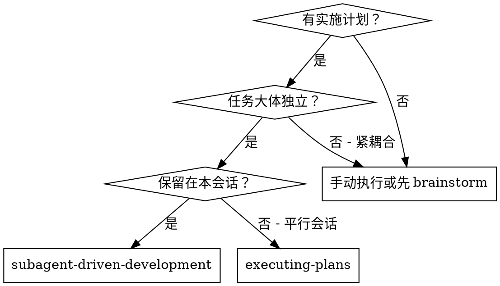
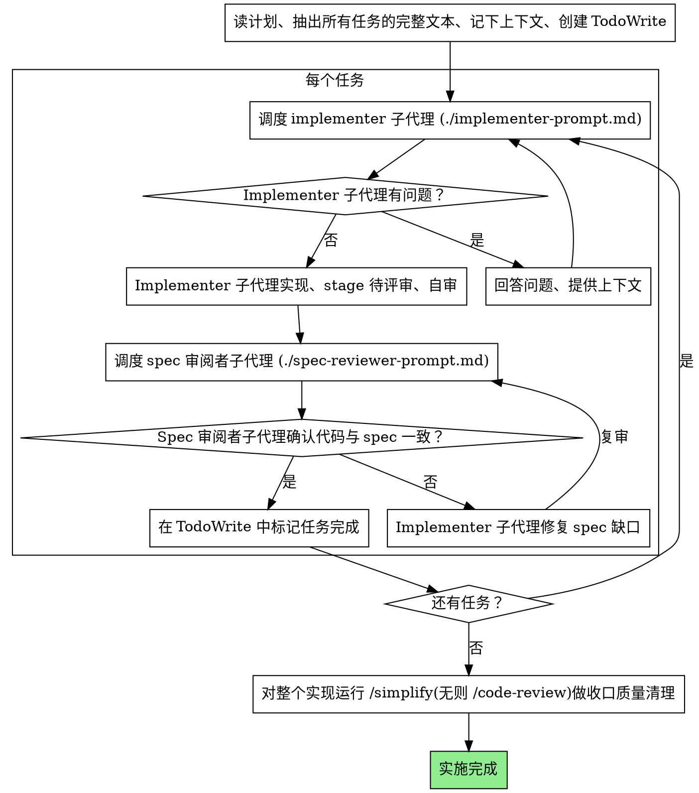

# 子代理驱动开发

每个任务调度一个全新的子代理来执行计划，每个任务后做一次 spec 合规性评审。所有任务完成后，再对整个实现做一次收口质量清理：有 `/simplify` 就跑 `/simplify`，否则退回 `/code-review`。

**为什么用子代理：** 你将任务委派给上下文隔离的专门代理。通过精确构造它们的指令和上下文，确保它们专注并完成任务。它们绝不应继承你会话的上下文或历史——你为它们构造的恰是它们所需。这同时保留了你自己的上下文用于协调工作。

**核心原则：** 每个任务一个全新子代理 + 每任务 spec 评审 + 收口一次质量清理（`/simplify`，无则 `/code-review`）= 高质量、低噪音、快速迭代

**连续执行：** 不要在任务之间停下来跟你的协作伙伴对接。一口气把计划里所有任务都执行完。停下的唯一理由是：你无法解决的 BLOCKED 状态、确实阻塞推进的模糊点，或所有任务已完成。"我该继续吗？" 之类的询问和进度摘要浪费用户时间——他们让你执行计划，那就执行。

## 何时使用



**vs. Executing Plans（平行会话）：**
- 同一会话（无上下文切换）
- 每任务一个全新子代理（无上下文污染）
- 每任务做 spec 合规评审；所有任务完成后收口一次质量清理（`/simplify`，无则 `/code-review`）
- 更快的迭代（任务之间无 human-in-loop）

## 流程



## 模型选择

用能胜任的最弱模型来节省成本、提高速度。

**机械式实现任务**（独立函数、清晰 spec、1-2 个文件）：用快、便宜的模型。当计划写得很细时，大多数实现任务是机械的。

**集成与判断任务**（多文件协调、模式匹配、调试）：用标准模型。

**架构、设计和评审任务**：用可用的最强模型。

**任务复杂度信号：**
- 涉及 1-2 个文件且 spec 完整 → 便宜模型
- 涉及多个文件且有集成顾虑 → 标准模型
- 需要设计判断或对代码库的广泛理解 → 最强模型

## 处理 Implementer 状态

Implementer 子代理会汇报四种状态之一。各自妥善处理：

**DONE：** 进入 spec 合规性评审。

**DONE_WITH_CONCERNS：** Implementer 完成了工作但提出了顾虑。继续前先读这些顾虑。如果顾虑涉及正确性或范围，先解决再去评审。如果只是观察（比如"这个文件越来越大"），记下并继续到评审。

**NEEDS_CONTEXT：** Implementer 需要未被提供的信息。提供缺失的上下文并重新调度。

**BLOCKED：** Implementer 无法完成任务。评估阻塞原因：
1. 如果是上下文问题，提供更多上下文，用同一模型重新调度
2. 如果任务需要更强的推理，换更强模型重新调度
3. 如果任务太大，拆成更小的片段
4. 如果计划本身错了，升级给用户

**永远不要**忽略上报，或不做改变就让同一模型再试一遍。Implementer 说卡住了，就一定要改变点什么。

## Prompt 模板

- `./implementer-prompt.md` - 调度 implementer 子代理
- `./spec-reviewer-prompt.md` - 调度 spec 合规审阅者子代理
- 收口质量清理（所有任务完成后做一次）：有 `/simplify` 就用 `/simplify`，否则用 `/code-review`，直接把改动应用到工作区

## 示例工作流

```
你: 我正在使用 Subagent-Driven Development 执行此计划。

[一次性读取计划文件: docs/superpowers/plans/feature-plan.md]
[抽出全部 5 个任务的完整文本和上下文]
[用所有任务创建 TodoWrite]

Task 1: Hook 安装脚本

[获取 Task 1 的文本和上下文（已抽出）]
[用完整任务文本 + 上下文调度 implementation 子代理]

Implementer: "开始前——hook 应该装在用户级还是系统级？"

你: "用户级（~/.config/superpowers/hooks/）"

Implementer: "明白。现在开始实现……"
[稍后] Implementer:
  - 实现了 install-hook 命令
  - 静态检查通过（shellcheck / 项目 lint）
  - 自审：发现漏了 --force 标志，已加上
  - 已暂存待评审（未提交）

[调度 spec 合规审阅者]
Spec reviewer: ✅ Spec 合规——所有需求满足，没多余的

[标记 Task 1 完成]

Task 2: 恢复模式

[获取 Task 2 的文本和上下文（已抽出）]
[用完整任务文本 + 上下文调度 implementation 子代理]

Implementer: [无问题，开始]
Implementer:
  - 加了 verify/repair 模式
  - 静态检查通过；本任务明确要求测试覆盖，加了 8 条单元测试，全部通过
  - 自审：都没问题
  - 已暂存待评审（未提交）

[调度 spec 合规审阅者]
Spec reviewer: ❌ 问题：
  - 缺失：进度上报（spec 说"每 100 项上报一次"）
  - 多余：加了 --json 标志（未请求）

[Implementer 修问题]
Implementer: 删了 --json 标志，加了进度上报

[Spec reviewer 再次评审]
Spec reviewer: ✅ 现已合规

[标记 Task 2 完成]

...

[所有任务完成后，对整个实现做收口清理：有 /simplify 跑 /simplify，否则 /code-review]
/simplify: 应用了 3 处清理（提取 PROGRESS_INTERVAL 常量、合并重复的 helper、简化一处守卫判断）。已暂存待你审阅。

完成！
```

## 优势

**vs. 手动执行：**
- 子代理精确遵循计划步骤
- 每个任务都是全新上下文（不会混淆）
- 并行安全（子代理互不干扰）
- 子代理可以提问（开始前和工作中）

**vs. Executing Plans：**
- 同一会话（无交接）
- 持续推进（不等待）
- 自动评审检查点

**效率提升：**
- 无文件读取开销（controller 提供完整文本）
- Controller 精确策划所需的上下文
- 子代理一上来就拿到完整信息
- 问题在工作开始前就浮出（不是事后）

**质量门：**
- 自审在交接前发现问题
- 每任务 spec 合规评审，评审循环确保修复确实生效
- Spec 合规阻止过建/欠建
- 收口一次质量清理（`/simplify`，无则 `/code-review`）处理整个实现的重用/简化/效率问题（低噪音，直接应用而非产出争议清单）

**成本：**
- 子代理调用更多（每任务 implementer + 1 个 spec reviewer）
- Controller 准备工作更多（前期抽出所有任务）
- 评审循环增加迭代
- 但能更早发现问题（比后期调试便宜）

## 红线

**绝不：**
- 未经用户明确同意，不要在 main/master 分支上开始实施
- 跳过每任务的 spec 合规评审，或跳过收口的质量清理（`/simplify` / `/code-review`）
- 带着未修复的问题继续
- 并行调度多个 implementation 子代理（会冲突）
- 让子代理去读计划文件（要提供完整文本）
- 跳过场景铺垫（子代理需要理解任务的位置）
- 忽略子代理的问题（先答完再让它继续）
- "差不多就行"地接受 spec 合规（spec reviewer 发现问题 = 没做完）
- 跳过评审循环（reviewer 发现问题 = implementer 修 = 再评审）
- 让 implementer 的自审替代真正的评审（两者都需要）
- spec 评审有未关闭的问题时就推进下一任务

**如果子代理提问：**
- 清晰、完整地回答
- 必要时提供额外上下文
- 不要催它进入实现

**如果 reviewer 发现问题：**
- 由（同一）Implementer 子代理修复
- Reviewer 再次评审
- 重复直到 approved
- 不要跳过复审

**如果子代理任务失败：**
- 调度修复子代理并给出具体指令
- 不要手动修（会污染上下文）

## 集成

**相关 skills：**
- **writing-plans** - 创建本 skill 要执行的计划
- **executing-plans** - 替代方案：同会话批量执行（无每任务评审）
