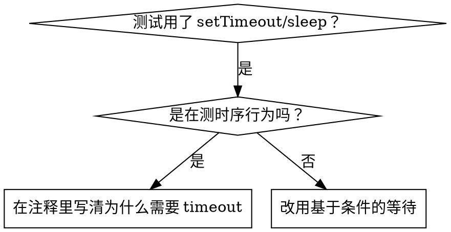

# 基于条件的等待

## 概述

不稳定的测试常常用任意延迟来猜时序。这会造出竞态——快机器上能过、负载下或 CI 中失败。

**核心原则：** 等待你真正在意的条件，而不是猜它需要多久。

## 何时使用



**使用场景：**
- 测试有任意延迟（`setTimeout`、`sleep`、`time.sleep()`）
- 测试不稳定（有时过，负载下挂）
- 并行运行时测试超时
- 等待异步操作完成

**不要使用：**
- 在测真正的时序行为（debounce、throttle 间隔）
- 用任意 timeout 时，总是要注释**为什么**

## 核心模式

```typescript
// ❌ 之前：在猜时序
await new Promise(r => setTimeout(r, 50));
const result = getResult();
expect(result).toBeDefined();

// ✅ 之后：等待条件
await waitFor(() => getResult() !== undefined);
const result = getResult();
expect(result).toBeDefined();
```

## 快速模式

| 场景 | 模式 |
|----------|---------|
| 等事件 | `waitFor(() => events.find(e => e.type === 'DONE'))` |
| 等状态 | `waitFor(() => machine.state === 'ready')` |
| 等计数 | `waitFor(() => items.length >= 5)` |
| 等文件 | `waitFor(() => fs.existsSync(path))` |
| 复合条件 | `waitFor(() => obj.ready && obj.value > 10)` |

## 实现

通用轮询函数：
```typescript
async function waitFor<T>(
  condition: () => T | undefined | null | false,
  description: string,
  timeoutMs = 5000
): Promise<T> {
  const startTime = Date.now();

  while (true) {
    const result = condition();
    if (result) return result;

    if (Date.now() - startTime > timeoutMs) {
      throw new Error(`Timeout waiting for ${description} after ${timeoutMs}ms`);
    }

    await new Promise(r => setTimeout(r, 10)); // 每 10ms 轮询一次
  }
}
```

完整实现连同领域特定 helper（`waitForEvent`、`waitForEventCount`、`waitForEventMatch`）见本目录的 `condition-based-waiting-example.ts`，源自真实调试会话。

## 常见错误

**❌ 轮询过快：** `setTimeout(check, 1)` - 浪费 CPU
**✅ 修复：** 每 10ms 轮询一次

**❌ 没 timeout：** 条件永不满足就死循环
**✅ 修复：** 总是带 timeout 并给出清晰错误

**❌ 数据陈旧：** 在循环外缓存了状态
**✅ 修复：** 在循环内调用 getter 取新数据

## 任意 timeout **正确**的场景

```typescript
// 工具每 100ms 一个 tick——需要 2 个 tick 来验证部分输出
await waitForEvent(manager, 'TOOL_STARTED'); // 先：等触发条件
await new Promise(r => setTimeout(r, 200));   // 再：等已知时序行为
// 200ms = 100ms 间隔的 2 个 tick——有文档说明、有理由
```

**要求：**
1. 先等触发条件
2. 基于已知时序（不是猜）
3. 注释说明**为什么**

## 真实世界影响

来自调试会话（2025-10-03）：
- 修复了 3 个文件中的 15 个不稳定测试
- 通过率：60% → 100%
- 执行时间：快 40%
- 不再有竞态
