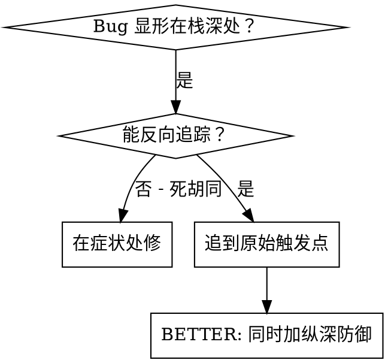
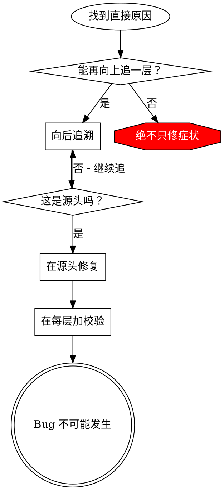

# 根因追踪

## 概述

bug 经常在调用栈深处显形（git init 跑错目录、文件写在错位置、数据库以错路径打开）。你的本能是在错误显形处修，但那是治标。

**核心原则：** 沿调用链反向追踪，直到找到原始触发点，然后在源头修复。

## 何时使用



**使用场景：**
- 错误发生在执行深处（非入口）
- Stack trace 显示长调用链
- 不清楚无效数据从哪儿来
- 需要找出哪个测试/代码触发了问题

## 追踪流程

### 1. 观察症状
```
Error: git init failed in ~/project/packages/core
```

### 2. 找直接原因
**哪段代码直接造成了这个？**
```typescript
await execFileAsync('git', ['init'], { cwd: projectDir });
```

### 3. 问：是谁调用了它？
```typescript
WorktreeManager.createSessionWorktree(projectDir, sessionId)
  → 被 Session.initializeWorkspace() 调用
  → 被 Session.create() 调用
  → 被测试 Project.create() 处调用
```

### 4. 继续向上追
**传进来什么值？**
- `projectDir = ''`（空字符串！）
- 空字符串作为 `cwd` 解析成 `process.cwd()`
- 那是源码目录！

### 5. 找到原始触发点
**空字符串从哪儿来？**
```typescript
const context = setupCoreTest(); // 返回 { tempDir: '' }
Project.create('name', context.tempDir); // 在 beforeEach 之前被访问！
```

## 添加 stack trace

当你不能手动追踪时，加埋点：

```typescript
// 在问题操作前
async function gitInit(directory: string) {
  const stack = new Error().stack;
  console.error('DEBUG git init:', {
    directory,
    cwd: process.cwd(),
    nodeEnv: process.env.NODE_ENV,
    stack,
  });

  await execFileAsync('git', ['init'], { cwd: directory });
}
```

**关键：** 测试中用 `console.error()`（不要 logger——可能不显示）

**运行并捕获：**
```bash
npm test 2>&1 | grep 'DEBUG git init'
```

**分析 stack trace：**
- 找测试文件名
- 找触发调用的行号
- 识别模式（同一测试？同一参数？）

## 找出哪个测试造成污染

如果测试期间出现某物但你不知道是哪个测试：

使用本目录的二分脚本 `find-polluter.sh`：

```bash
./find-polluter.sh '.git' 'src/**/*.test.ts'
```

逐个跑测试，首个污染者出现时停下。用法见脚本。

## 真实示例：空的 projectDir

**症状：** `.git` 出现在 `packages/core/`（源码中）

**追踪链：**
1. `git init` 跑在 `process.cwd()` ← 空 cwd 参数
2. WorktreeManager 被以空 projectDir 调用
3. Session.create() 传入了空字符串
4. 测试在 beforeEach 之前访问了 `context.tempDir`
5. setupCoreTest() 初始返回 `{ tempDir: '' }`

**根因：** 顶层变量初始化访问了空值

**修复：** 把 tempDir 变成 getter，若在 beforeEach 前被访问就抛错

**还加了纵深防御：**
- 层 1：Project.create() 校验目录
- 层 2：WorkspaceManager 校验非空
- 层 3：NODE_ENV 守卫拒绝 tmpdir 外的 git init
- 层 4：git init 之前的 stack trace 日志

## 关键原则



**绝不只在错误显形处修。** 追到原始触发点。

## Stack trace 小贴士

**测试中：** 用 `console.error()` 而非 logger——logger 可能被压制
**操作之前：** 在危险操作**之前**记录，而非失败之后
**含上下文：** 目录、cwd、环境变量、时间戳
**捕获 stack：** `new Error().stack` 显示完整调用链

## 真实世界影响

来自调试会话（2025-10-03）：
- 通过 5 层追踪找到根因
- 在源头修复（getter 校验）
- 加了 4 层防御
- 1847 个测试通过，零污染
