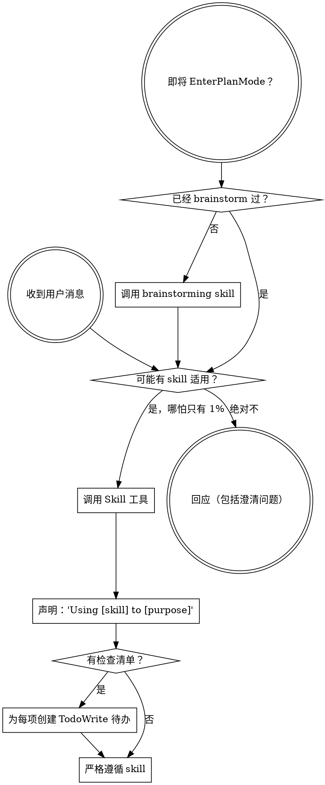

<SUBAGENT-STOP>
如果你是被作为子代理派来执行特定任务的，跳过这个 skill。
</SUBAGENT-STOP>

# 使用 Skills

## 核心规则

在回应用户消息之前，检查是否有可用的 skill 适用。
如果是，在产生任何其他输出（包括澄清问题）之前，
通过 Skill 工具调用它。简短声明："Using [skill] to [purpose]"。

## 如何访问 Skills

Skills 默认遵循 Claude Code 约定。各平台有自己的访问方式：

- **Claude Code：** 使用 `Skill` 工具。调用时 skill 的内容会被加载——直接遵循即可。绝不要用 Read 工具读取 skill 文件。
- **GitHub Copilot CLI：** 使用 `skill` 工具（语义与 Claude Code 的 `Skill` 工具相同）。
- **Gemini CLI：** skills 通过 `activate_skill` 激活。Gemini 在会话开始时加载元数据，按需激活完整内容。
- **Codex CLI / 其他平台：** 见本目录下的 `references/` 查工具名等价对照。

通用兜底：自己读取 SKILL.md 内容并按其指导操作。

## 指令优先级（最高 → 最低）

1. **用户指令** — CLAUDE.md、AGENTS.md、用户直接请求
2. **Skills** — 当冲突时覆盖默认系统行为
3. **默认系统 prompt**

如果用户指令与 skill 冲突，遵循用户。用户说了算。

## 红色信号——如果你想到以下任一，停下来

- "这只是一个简单问题" → 问题就是任务，检查是否有 skill
- "我得先收集更多上下文" → 检查 skill 必须先于澄清问题
- "让我先探索一下代码库" → skills 会告诉你怎么探索
- "这事不需要正式 skill" → 如果存在 skill，就用它
- "用 skill 太重了" → 简单的事情会变复杂
- "我知道那是什么意思" → 知道概念 ≠ 使用 skill
- "我先做完这一件事再说" → 在做任何事之前先检查
